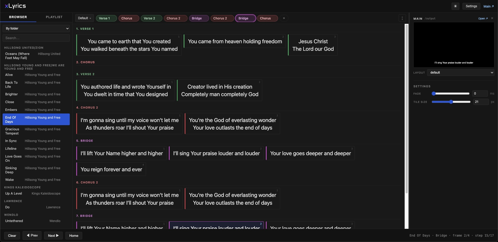

<p align="center">
  
  
</p>

<p align="center">
  A lightweight, browser-based lyrics presentation tool for churches and events.
</p>

---

## What it is

xLyrics is a tiny local Node server + browser UI that turns folders of `.txt`
files into live presentation outputs. You drive a control page from a laptop
and project to one or more browser-based outputs (an external monitor, a stage display, OBS browser source, anywhere a browser source can render).

- **Songs are plain text.** Edit them in any editor — xLyrics watches the
  folder and reloads on save.
- **Arrangements** are stored alongside the lyrics, so the same song can have
  different orders for different services.
- **Layouts are HTML.** Drop a `.xlayout` file into `layouts/` and assign it
  to an output — full CSS, optional `<script>`, transitions and all.
- **Multiple outputs.** Run a Main projector, a Stage display with a clock,
  and a chroma-key feed for video — all from one control page.
- **Resolume integration.** Stream the current line straight into a Text
  Block clip via OSC. 

## Quick start

```bash
git clone https://github.com/Socapexxx/xlyrics.git
cd xlyrics
npm install
npm start
```

Then open <http://localhost:3000/> in a browser. Drop song files into
`songs/` to populate the library.

Requires Node.js ≥ 18.

## Control UI
<p align="center">
  
</p>

## Song file format

```text
title: Amazing Grace
artist: Traditional
Arrangement = Verse 1, Chorus, Verse 2, Chorus

----

[Verse 1]
Amazing grace, how sweet the sound
That saved a wretch like me

[Chorus]
How sweet the sound

[Verse 2]
'Twas grace that taught my heart to fear
And grace my fears relieved
```

- Header (above `----`): metadata and arrangements (`@name = section, section, …`).
- Body (below `----`): named sections in `[Brackets]`, with a "#" at the start `#Verse`, or a colon after `Chorus:`. Blank lines split a
  section into "frames" — one frame at a time goes on screen.

## Layouts

Layouts live in `layouts/` as `.xlayout` files (HTML + `<style>` + optional
`<script>`). Use these template variables — the runtime swaps them for live
spans on each frame change:

| Variable | What it shows |
| --- | --- |
| `{{current}}` | The current frame (fades on change) |
| `{{next}}`    | The next frame (for stage displays) |
| `{{section}}` | Current section name |
| `{{song_title}}` | Song title from the header |

Ships with: `default`, `middle`, `top`, `box`, `corners`, `chroma`
(green-screen with per-line bars), and `stage` (big text + live clock).

## Resolume

In Settings → Resolume, enable OSC and aim at a Text Block clip. Default
target is layer 1 / clip 1. Resolume → Preferences → OSC must be enabled
(default port 7000).

You can add more than one clip for different looks, and choose to "re-trigger" the clip. This is useful for one-shot style effects.

## OSC
OSC Control is available. You can configure it in the network tab.
Currently only control over basic tasks is possible, but it should get you by.

You can use Companion to control xLyrics using the "Generic OSC" plugin. Simply use the send string action, and leave value empty.
## Configuration

`config.json` is generated at the project root the first time you save
settings. It is gitignored by default — your sections, outputs, and OSC
config stay on your machine.

## Disclaimer
This is basically all vibe coded. My testing shows that its pretty stable. I've only tested on macos thus far.

## License

MIT — see [LICENSE](LICENSE).
